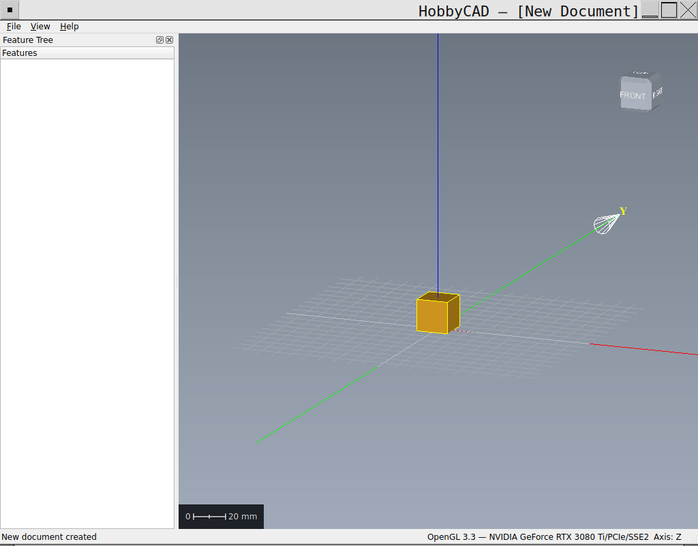

# HobbyCAD

<!-- File: README.md -->

<p align="center">
  
  <br><br>
  
  
  
  
  
  <br>
  <a href="https://github.com/ayourk/hobbycad/actions/workflows/linux-build.yml"></a>
  <a href="https://github.com/ayourk/hobbycad/actions/workflows/windows-build.yml"></a>
  <a href="https://github.com/ayourk/hobbycad/actions/workflows/macos-build.yml"></a>
  <a href="https://github.com/ayourk/hobbycad-vcpkg/actions/workflows/build-ports.yml"></a>
</p>

**A Linux-native, open-source, parametric 3D CAD application — for hobbyists, by hobbyists.**

<p align="center">
  
</p>

HobbyCAD is a parametric 3D solid modeler designed for mechanical engineering, product design, and hobbyist fabrication. It delivers professional-quality tools without proprietary software, cloud lock-in, or subscription fees.

HobbyCAD is accompanied by **HobbyMesh**, a companion mesh editing and 3D printing preparation tool inspired by Autodesk Meshmixer, built from the same codebase.

> **AI Attribution:** This project's documentation, architecture decisions, and initial code generation are produced with the assistance of Claude AI (Anthropic), with human oversight, editorial direction, and final decision-making by the project author.

## Key Principles

- **Offline-first** — No cloud dependency, no account, no telemetry. Your data stays on your machine.
- **Version control is our cloud** — All collaboration and sharing flows through git and GitHub/GitLab, not a proprietary backend.
- **Linux-first, cross-platform ready** -- Developed and optimized for Linux. Windows CI builds with both MSYS2/GCC and MSVC toolchains. macOS CI builds with Homebrew/Clang.
- **Depth over breadth** — Core mechanical CAD done exceptionally well, rather than a sprawling, half-finished feature set.
- **Open standards** — BREP native format (open, documented), STEP/STL/OBJ interchange. No vendor lock-in.

## Features

### HobbyCAD Core

- Parametric 3D solid modeling using B-Rep geometry (OpenCASCADE)
- 2D parametric sketch editor with constraint solver
- Feature-based modeling: extrude, revolve, fillet, chamfer, pattern, Boolean operations, sweep, loft
- Feature history tree with parametric modification
- Multi-body part design with construction bodies
- Assembly design with mates and constraints
- Python scripting and plugin system with macro recording
- Built-in git integration for project history and collaboration
- Directory-first project format (`.hcad` manifest + plain-text files) — fully inspectable, hand-editable, and diff-friendly
- Tiered startup: Full Mode (OpenGL 3.3+), Reduced Mode (GUI without 3D viewport), Command-Line Mode (headless/batch)

### HobbyMesh Companion Tool (Planned)

- Mesh editing, repair, and analysis
- 3D printing preparation: Make Solid, hollowing, supports, orientation optimization, wall thickness analysis
- Mesh sculpting and remeshing
- Mesh Boolean operations
- Mesh-to-B-Rep conversion (phased implementation)
- Operates standalone or as a HobbyCAD plugin

## Technology Stack

| Layer | Library | License |
|---|---|---|
| Modeling Kernel | OpenCASCADE (OCCT) | LGPL 2.1 |
| GUI Framework | Qt 6 | LGPL 3.0 |
| 3D Viewport | OCCT AIS + OpenGL 3.3+ | LGPL 2.1 |
| Constraint Solver | SolveSpace Solver | GPL 3.0 |
| Native File Format | BREP (OCCT built-in) | LGPL 2.1 |
| STEP/STL I/O | OCCT (built-in) | LGPL 2.1 |
| OBJ I/O | OCCT / Assimp | LGPL 2.1 / BSD |
| Python Scripting | CPython + pybind11 | PSF / BSD |
| Version Control | libgit2 | GPL 2.0 + LE |

**Build requirements:** CMake 3.20+, GCC 12+ or Clang 15+, C++17 (C++20 preferred), Python 3.10+

**Primary development platform:** Ubuntu 24.04 LTS

**HobbyCAD PPA** — some dependencies are not in the Ubuntu repositories and are provided via a Launchpad PPA:

```
sudo add-apt-repository ppa:ayourk/hobbycad
sudo apt-get update
```

Current PPA packages (as of 2026-02-08): libslvs, libopenmesh, lib3mf, meshfix — all built for Jammy (22.04) and Noble (24.04). See [`docs/dev_environment_setup.txt` §7–8](docs/dev_environment_setup.txt#L718) for details.

**HobbyCAD vcpkg Registry** — the same four libraries are available for Windows (and macOS) via a custom vcpkg registry. The repository ships `vcpkg.json` and `vcpkg-configuration.json` in the project root — vcpkg resolves the custom registry automatically during the build. See [`docs/dev_environment_setup.txt` §15.2](docs/dev_environment_setup.txt#L1755) for details.

Registry: https://github.com/ayourk/hobbycad-vcpkg

**HobbyCAD Homebrew Tap** — the same four libraries are available for macOS via a Homebrew tap. See [`docs/dev_environment_setup.txt` §22.6](docs/dev_environment_setup.txt#L2511) for details.

```
brew tap ayourk/hobbycad
```

Tap: https://github.com/ayourk/homebrew-hobbycad

## Development Setup

Full setup instructions are in [`docs/dev_environment_setup.txt`](docs/dev_environment_setup.txt).

### Ubuntu 24.04 LTS (Primary Development Platform)

| | Section | Description |
|---|---|---|
| **Quick Start** | [One-line install](docs/dev_environment_setup.txt#L447) (§4.10) | Single `apt install` for all Phase 0 dependencies |
| **Dependencies** | [Package installation](docs/dev_environment_setup.txt#L288) (§4) | Per-component install with explanations |

### Ubuntu 22.04 LTS (Minimum Target)

| | Section | Description |
|---|---|---|
| **Quick Start** | [One-line install](docs/dev_environment_setup.txt#L551) (§5.6) | Single `apt install` for all Phase 0 dependencies |
| **Dependencies** | [Package installation](docs/dev_environment_setup.txt#L471) (§5) | Package differences from 24.04 |

**CI:** The [Linux Build](.github/workflows/linux-build.yml) workflow builds on Ubuntu 24.04 with GCC and apt packages, matching the primary development platform.

### Windows

| | Section | Description |
|---|---|---|
| **Quick Start** | Run [`tools\windows\setup-env.ps1`](tools/windows/setup-env.ps1) | Installs MSYS2, toolchain, vcpkg, and all dependencies |
| **Build** | `cmake --preset msys2-debug` | Or `msvc-debug` for MSVC; also [`tools\windows\build-dev.bat`](tools/windows/build-dev.bat) |
| | [Overview](docs/dev_environment_setup.txt#L1490) (§13) | Platform status and known limitations |
| | [Prerequisites](docs/dev_environment_setup.txt#L1580) (§14) | MSYS2/MinGW-w64 or MSVC requirements |
| | [vcpkg setup](docs/dev_environment_setup.txt#L1727) (§15) | Package manager and custom registry configuration |
| | [vcpkg dependencies](docs/dev_environment_setup.txt#L1836) (§16) | Installing Phase 0 dependencies |
| | [Custom registry ports](docs/dev_environment_setup.txt#L1978) (§17.3) | libslvs, openmesh, lib3mf, meshfix (Phase 1+) |
| | [Building](docs/dev_environment_setup.txt#L2038) (§18) | Build instructions for Windows |
| | [Troubleshooting](docs/dev_environment_setup.txt#L2178) (§19) | Windows-specific issues |

**CI:** The [Windows Build](.github/workflows/windows-build.yml) workflow runs two parallel jobs -- "HobbyCAD via MSYS" (MSYS2 UCRT64 / GCC, matching the local developer setup) and "HobbyCAD via MSVC" (Visual Studio / vcpkg manifest mode).

### macOS

| | Section | Description |
|---|---|---|
| **Quick Start** | Run [`tools/macos/setup-env.sh`](tools/macos/setup-env.sh) | Installs Xcode CLT, Homebrew, all dependencies, and configures paths |
| **Build** | `cmake --preset macos-debug` | Also [`./tools/macos/build-dev.sh`](tools/macos/build-dev.sh) |
| | [Overview](docs/dev_environment_setup.txt#L2253) (§20) | Platform status and OpenGL limitations |
| | [Prerequisites](docs/dev_environment_setup.txt#L2304) (§21) | Xcode and Homebrew requirements |
| | [Homebrew dependencies](docs/dev_environment_setup.txt#L2407) (§22) | Installing dependencies via Homebrew |
| | [Homebrew tap](docs/dev_environment_setup.txt#L2511) (§22.6) | libslvs, openmesh, lib3mf, meshfix (Phase 1+) |
| | [Architecture notes](docs/dev_environment_setup.txt#L2573) (§23) | Intel vs. Apple Silicon considerations |
| | [Building](docs/dev_environment_setup.txt#L2658) (§25) | Build instructions for macOS |
| | [Troubleshooting](docs/dev_environment_setup.txt#L2749) (§26) | macOS-specific issues |

**CI:** The [macOS Build](.github/workflows/macos-build.yml) workflow builds with Homebrew/Clang on Apple Silicon, matching the local developer setup from `setup-env.sh`.

### General

| Section | Description |
|---|---|
| [Prerequisites](docs/dev_environment_setup.txt#L180) (§3) | Required tools and minimum versions |
| [PPA packages](docs/dev_environment_setup.txt#L718) (§7) | Dependencies requiring source build or PPA (libslvs, etc.) |
| [Launchpad PPA](docs/dev_environment_setup.txt#L829) (§8) | PPA setup, packaging workflow, versioning |
| [Version differences](docs/dev_environment_setup.txt#L573) (§6) | OCCT, Qt, and Python differences between 22.04 and 24.04 |
| [Verify installation](docs/dev_environment_setup.txt#L1053) (§9) | Dependency and OpenGL verification steps |
| [Building Phase 0](docs/dev_environment_setup.txt#L1224) (§11) | Clone, dev build, .deb, and AppImage instructions |
| [Troubleshooting](docs/dev_environment_setup.txt#L1404) (§12) | Common build issues and fixes |

## Development Phases

| Phase | Goal | Key Deliverable |
|---|---|---|
| **Phase 0** | Foundation | Buildable app with OCCT viewer, BREP I/O, tiered startup |
| **Phase 1** | Basic Modeling | 2D sketch → extrude → solid, project files browser, STEP export |
| **Phase 2** | Parametric Features | Fillet, chamfer, pattern, shell, multi-body, construction bodies |
| **Phase 3** | Python & Version Control | Embedded Python, plugin system, macro recorder, git integration |
| **Phase 4** | Assemblies | Multi-part assemblies, mates, interference detection, BOM |
| **Phase 5** | HobbyMesh | Mesh editing, repair, sculpting, 3D print prep |
| **Phase 6** | Advanced Features | Mesh-to-STEP, OpenSCAD import, IGES/DXF/3MF, 2D drawings |

## System Requirements

**Minimum (Full Mode):**
- Linux (Ubuntu 22.04+ recommended), Windows, or macOS
- OpenGL 3.3+ capable GPU with 1 GB+ VRAM
- 8 GB RAM, 2 GB disk space

**Reduced Mode** works without OpenGL 3.3 — the GUI launches with all non-visual features functional (sketch editing, file conversion, scripting). The 3D viewport is replaced with an informational panel.

**Command-Line Mode** requires no display server or GPU at all — suitable for headless servers, CI/CD, and batch processing.

## Licensing

HobbyCAD and HobbyMesh are licensed under the **GNU General Public License v3.0 only** (not "or later").

- **Plugins** that link against HobbyCAD libraries must be GPL 3.0
- **Python scripts** that call the scripting API are user content, not derivative works — you may license them however you choose
- **Forks** must use a different name (the HobbyCAD and HobbyMesh names are project trademarks)
- A **commercial license** may be offered in the future for entities redistributing HobbyCAD or derivatives commercially
- **AGPL 3.0** is under consideration and may be adopted at any time; the copyright assignment policy preserves this option

See [`docs/project_definition.txt` §12](docs/project_definition.txt#L1414) for the full licensing framework.

## Contributing

Contributions are welcome. All code merged into the main repository requires copyright assignment to the project author, enabling unified licensing decisions. Contributors are acknowledged in the `AUTHORS` file.

A contribution agreement (CLA) mechanism will be defined before external contributions are accepted. See [`docs/project_definition.txt` §12.5–12.7](docs/project_definition.txt#L1551) for details.

## Project Documentation

All project documentation is in plain text format:

| Document | Description |
|---|---|
| [`docs/project_definition.txt`](docs/project_definition.txt) | Project scope, design principles, file format spec, development phases, licensing framework |
| [`docs/cad_library_recommendations.txt`](docs/cad_library_recommendations.txt) | Library analysis, alternatives considered, licensing, HobbyMesh stack |
| [`docs/cad_use_case_document.txt`](docs/cad_use_case_document.txt) | Use cases, target audience, competitive analysis, HobbyMesh specification |
| [`docs/dev_environment_setup.txt`](docs/dev_environment_setup.txt) | Build environment setup for Ubuntu, Windows, and macOS |
| [`docs/security_risks.txt`](docs/security_risks.txt) | Threat model, mitigations for file parsing, scripting, network, supply chain |
| [`docs/coding_standards.txt`](docs/coding_standards.txt) | File conventions and C++ style |
| [`docs/theming.txt`](docs/theming.txt) | GUI theming guide |
| [`AUTHORS`](AUTHORS) (Project root) | Project author and contributor listing |

## Competitive Landscape

HobbyCAD aims to fill a specific gap in the open-source CAD ecosystem:

- **vs. Fusion 360 / Onshape** — Excellent commercial tools, but require cloud connectivity, subscriptions, and send telemetry. HobbyCAD is fully offline — your files are local, version control runs through git, and there's no account to create.
- **vs. FreeCAD** — FreeCAD is the most established open-source parametric CAD. HobbyCAD takes a different approach: a single unified workflow rather than separate workbenches, built from a clean codebase with opinionated UX decisions. FreeCAD's maturity and community are significant advantages; HobbyCAD trades that ecosystem for architectural cohesion.
- **vs. OpenSCAD** — OpenSCAD's code-first approach is powerful for programmatic modeling. HobbyCAD provides a visual parametric GUI with an optional Python scripting layer for automation.
- **vs. SolidWorks / Inventor** — Industry-standard tools with deep feature sets. HobbyCAD targets hobbyists and makers who need solid modeling without commercial license costs or platform restrictions.

HobbyMesh aims to fill the gap left by Autodesk Meshmixer (discontinued, never fully supported on Linux) for mesh editing and 3D print preparation.

## Contact

Aaron Yourk — ayourk@gmail.com

